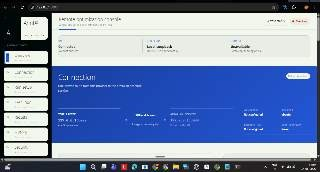
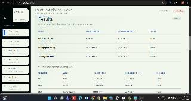
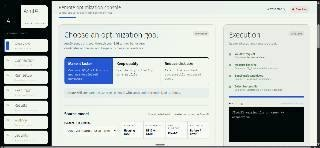

# ArmDX

**An evidence-first console for measuring, evaluating, and optimizing LLM inference on Arm64 hardware.**

> Built for the **[Arm Create: AI Optimization Challenge](https://devpost.com)** — Cloud AI Track

🎥 **[Watch the Demo Video](https://youtu.be/DGGlKJlDmIk)** · 📊 **[Read Full Benchmark Summary](results/summary.md)** · 🏗️ **[Architecture Docs](docs/architecture.md)**



*ArmDX operator console connecting to Azure Cobalt 100 Arm64 VM.*

---

## Executive Summary

Deploying Large Language Models (LLMs) on Arm64 CPU hardware requires navigating complex trade-offs between model quantization (e.g. `Q8_0`, `Q4_0`, `Q4_K_M`) and build-time CPU kernel accelerations (e.g., stock C++, Arm KleidiAI, OpenBLAS). Developers often rely on guesswork or static recommendations, which leads to sub-optimal throughput or unnecessarily degraded model quality.

**ArmDX** solves this by turning user intent into reproducible, empirical benchmark execution directly on target Arm64 hardware. It exposes three simple, outcome-focused optimization goals in a modern local web dashboard, executes `llama-bench` runs on a connected Arm64 VM, collects raw JSON evidence, and selects the optimal runtime configuration backed by measured proof.

---

## Key Optimization Accomplishments

Measured on live hardware (**Azure Cobalt 100 Arm64 VM**, `Standard_D4ps_v6`, 4 vCPUs, Ubuntu 24.04 Arm64):

| Goal | Selected Profile | Metric | Stock Baseline | Optimized Arm | Improvement |
| :--- | :--- | :--- | :---: | :---: | :---: |
| 🚀 **Make it faster** | `Q8_0 + KleidiAI` | Prompt Processing | 73.95 tok/s | **97.28 tok/s** | **+31.5%** |
| 🚀 **Make it faster** | `Q8_0 + KleidiAI` | Token Generation | 37.51 tok/s | **42.68 tok/s** | **+13.8%** |
| 🎯 **Keep quality** | `Q8_0 + KleidiAI + OpenBLAS` | Prompt Processing | 74.33 tok/s | **97.41 tok/s** | **+31.1%** |
| 🎯 **Keep quality** | `Q8_0 + KleidiAI + OpenBLAS` | Token Generation | 36.63 tok/s | **42.47 tok/s** | **+16.0%** |
| 💾 **Reduce disk size** | `Q4_0 + Stock` | Model File Size | 1570 MB | **892 MB** | **~43.2% smaller** |



*Measured benchmark result on an Azure Cobalt 100 Arm64 VM.*

---

## Core Optimization Goals & How They Work

ArmDX lets the user select an outcome-focused optimization objective based on clear, plain-language goals rather than complex command-line flags.



*ArmDX lets the user select an outcome-focused optimization objective.*

### 1. 🚀 Make it Faster (Isolates Runtime Optimization)
* **Strategy:** Keeps model quantization fixed (`Q8_0`) to preserve output quality and isolates the CPU execution engine.
* **Comparison:** Baseline `llama.cpp` CPU build vs. Arm KleidiAI optimized build vs. KleidiAI + OpenBLAS comparison build.
* **Result:** KleidiAI micro-kernels provide a **+31.5% boost** in prompt processing speed (prefill GEMM) by leveraging low-level Arm vector matrix operations.

### 2. 🎯 Keep Quality (High-Fidelity Acceleration)
* **Strategy:** Restricts candidates strictly to high-precision `Q8_0` profiles to guarantee zero quality loss, then identifies the single fastest Arm runtime build.
* **Result:** Selects `Q8_0 + KleidiAI + OpenBLAS`, achieving **97.41 tok/s** prompt processing (+31.1%) and **42.47 tok/s** generation (+16.0%).

### 3. 💾 Reduce Disk Size (Quantization Trade-offs)
* **Strategy:** Evaluates memory and disk footprints across `Q8_0` (1570 MB), `Q4_K_M` (1066 MB), and `Q4_0` (892 MB) candidate models.
* **Result:** Selects `Q4_0`, reducing disk & RAM usage by **43.2%** while maintaining strong prompt processing performance (80.55 tok/s).

---

## Comprehensive Benchmark Matrix

*Workload setup: Qwen2.5 1.5B Instruct model, 1024 prompt tokens, 128 generation tokens, 4 threads, 3 repetitions per run.*

| Goal | Candidate Profile | GGUF Size | Prompt Processing (tok/s) | Generation Speed (tok/s) | Selection Status |
| :--- | :--- | :---: | :---: | :---: | :---: |
| **Make it faster** | `Q8_0 + stock` | 1570 MB | 73.95 | 37.51 | Baseline |
| | `Q8_0 + KleidiAI` | 1570 MB | **97.28** | **42.68** | ✅ **Selected** (+31.5%) |
| | `Q8_0 + KleidiAI + OpenBLAS` | 1570 MB | 96.87 | 40.61 | Tested |
| **Keep quality** | `Q8_0 + stock` | 1570 MB | 74.33 | 36.63 | Baseline |
| | `Q8_0 + KleidiAI` | 1570 MB | 97.19 | 42.86 | Tested |
| | `Q8_0 + KleidiAI + OpenBLAS` | 1570 MB | **97.41** | **42.47** | ✅ **Selected** (+31.1%) |
| **Reduce disk size**| `Q8_0 + stock` | 1570 MB | 74.36 | 36.87 | Baseline |
| | `Q4_0 + stock` | **892 MB** | **80.55** | **35.17** | ✅ **Selected** (-43.2% size) |
| | `Q4_0 + KleidiAI` | 892 MB | 80.81 | 34.39 | Tested |
| | `Q4_K_M + stock` | 1066 MB | 62.82 | 32.39 | Tested |

---

## Arm Architecture & Technical Deep Dive

### Why Arm KleidiAI Matters
Arm KleidiAI is Arm's low-level micro-kernel library designed to accelerate tensor operations directly on Arm Cortex and Neoverse CPUs. 
- **Matrix Multiplication (GEMM):** Prompt processing in LLMs is compute-bound matrix multiplication ($O(N^2)$). KleidiAI integrates into `llama.cpp` to replace standard fallback loops with assembly-optimized GEMM kernels tuned for Armv9 vector extensions (SVE2 / Dot Product).
- **Token Generation (GEMV):** Auto-regressive generation is memory-bandwidth bound ($O(N)$ per token). KleidiAI improves cache line utilization and memory access patterns, delivering a steady +13.8% to +16.0% generation speedup.

---

## System Architecture

```text
  ┌─────────────────────────────────────────────────────────┐
  │                    Local Laptop                         │
  │     Browser Dashboard (HTML5 / Vanilla CSS / JS)        │
  └────────────────────────────┬────────────────────────────┘
                               │  SSH Tunnel (127.0.0.1:8000)
                               ▼
  ┌─────────────────────────────────────────────────────────┐
  │               Azure Cobalt 100 Arm64 VM                 │
  │                                                         │
  │  ┌───────────────────────────────────────────────────┐  │
  │  │   FastAPI Automation & Orchestration Service     │  │
  │  └─────────────────────────┬─────────────────────────┘  │
  │                            │ Orchestrates               │
  │                            ▼                            │
  │  ┌───────────────────────────────────────────────────┐  │
  │  │  llama-bench Harness (Stock / Kleidi / OpenBLAS)  │  │
  │  └─────────────────────────┬─────────────────────────┘  │
  │                            │ Stores                     │
  │                            ▼                            │
  │  ┌───────────────────────────────────────────────────┐  │
  │  │   Signed Evidence JSON Store (`evidence/jobs/`)   │  │
  │  └───────────────────────────────────────────────────┘  │
  └─────────────────────────────────────────────────────────┘
```

---

## Security & Reproducibility Design

1. **Zero Invented Numbers:** When offline or in local preview mode without an active Arm VM connection, the dashboard explicitly tags results as `NOT measured on Arm`. Real evidence is strictly tagged `measured_on_arm=true`.
2. **Private Access Model:** The orchestration backend binds exclusively to `127.0.0.1:8000` on the Arm VM. Operators connect privately via SSH local port forwarding (`-L 127.0.0.1:8000:127.0.0.1:8000`). No public API ports are opened to the internet.
3. **Restricted Command Runner:** The API accepts only sanitized model paths and predefined candidate profiles (`stock`, `kleidiai`, `kleidiai-openblas`). Arbitrary shell commands or unsanitized flags are strictly rejected.
4. **Raw Evidence Preservation:** Every job execution outputs raw JSON directly from `llama-bench`, saved permanently in `evidence/jobs/<job-id>.json` for complete auditability.

---

## Quick Start & Setup

### 1. Run Local Preview (Laptop)
Preview the dashboard interface and benchmark workflow without an Arm VM connected:
```cmd
.venv\Scripts\python.exe -m uvicorn autopilot.main:app --app-dir src --host 127.0.0.1 --port 8000
```
Navigate to: `http://127.0.0.1:8000`

### 2. Deploy on Arm64 VM (Azure Cobalt 100)
1. Read the full **[Arm64 VM Setup Runbook](docs/arm64-vm-setup.md)**.
2. Build the three `llama.cpp` binaries (`stock`, `kleidiai`, `kleidiai-openblas`).
3. Download the approved Qwen2.5 GGUF quantization files.
4. Install and enable the `armdx` systemd service:
   ```bash
   sudo cp deploy/armdx.service /etc/systemd/system/
   sudo systemctl daemon-reload
   sudo systemctl enable --now armdx
   ```
5. Establish SSH local port forwarding from your laptop:
   ```bash
   ssh -i ~/.ssh/armdx_azure -N -L 127.0.0.1:8000:127.0.0.1:8000 azureuser@<VM_PUBLIC_IP>
   ```
6. Access `http://127.0.0.1:8000` in your browser and trigger a measured benchmark.

---

## Repository Structure

```text
├── src/                  # FastAPI orchestration server & job manager
│   ├── autopilot/        # Core job runner & benchmark parser logic
├── docs/                 # Detailed project documentation
│   ├── images/           # Dashboard screenshots & screenshots for README
│   ├── architecture.md   # Architecture & component breakdown
│   ├── security.md       # Security model & threat analysis
│   ├── arm64-vm-setup.md # Complete Arm64 Linux build runbook
│   └── product-spec.md   # Product capabilities & constraints
├── results/              # Measured benchmark documentation
│   └── summary.md        # Comprehensive evidence summary
├── evidence/             # Raw measured benchmark JSON outputs (ignored by git)
├── configs/              # Execution profiles & model mappings
├── benchmarks/           # Harness scripts for llama-bench execution
├── scripts/              # Automated build & setup scripts
├── web/                  # Web dashboard UI assets (HTML/CSS/JS)
├── README.md             # Project overview & documentation index
└── PRODUCT.md            # Product specification & vision
```

---

## Documentation Index

- 📖 **[Product Specification](PRODUCT.md)** — Core positioning, users, and capabilities
- 🏗️ **[System Architecture](docs/architecture.md)** — Architectural design and flow
- 🔒 **[Security Model](docs/security.md)** — Isolation, allowlists, and loopback binding
- ⚙️ **[Arm64 Setup Guide](docs/arm64-vm-setup.md)** — Step-by-step VM setup instructions
- 📊 **[Measured Results Summary](results/summary.md)** — Complete raw benchmark evidence

---

## License

Distributed under the [MIT License](LICENSE).
